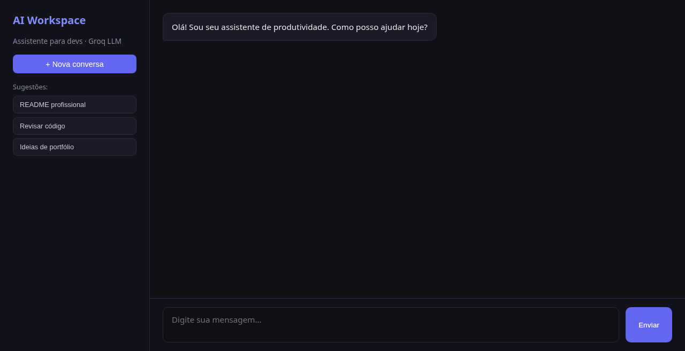
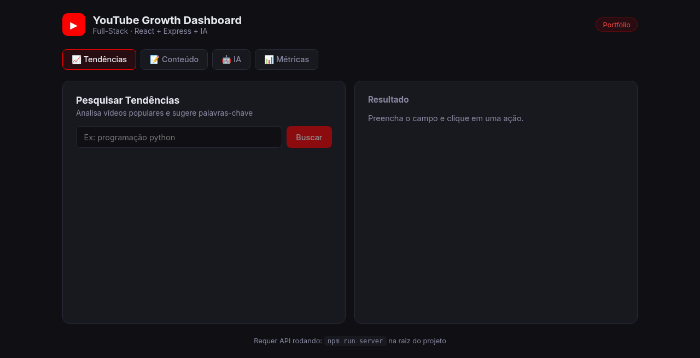

# Portfólio — João Victor

Projetos para currículo, com foco em vagas remotas.

**Currículo ao vivo:** https://dev-joaovictor.github.io/curriculo/

## Prévia

| Projeto | Screenshot |
|---------|------------|
| Site / Currículo |  |
| TaskFlow API |  |
| AI Workspace |  |
| YouTube Dashboard |  |


## O que tem aqui

| Projeto | O que é | Pasta |
|---------|---------|-------|
| Site | Landing React + TypeScript + Vite (TaskFlow em destaque) | [`site/`](./site/) |
| TaskFlow API | API de tarefas com JWT, OpenAPI, testes e Docker — recorte backend de referência | [`taskflow-api/`](./taskflow-api/) |
| AI Workspace | Chat web com Groq (UI em HTML/CSS/JS) | [`ai-workspace/`](./ai-workspace/) |
| YouTube Dashboard | Frontend React (backend Express ainda fora do monorepo) | [`youtube-dashboard/`](./youtube-dashboard/) |

## Como rodar

```bash
git clone https://github.com/dev-joaovictor/portfolio.git
cd portfolio
```

Depois entre na pasta do projeto (`site`, `taskflow-api`, `ai-workspace` ou `youtube-dashboard`) e siga o README local.

A TaskFlow API tem testes e CI na raiz do monorepo (`.github/workflows/taskflow-ci.yml`):

```bash
cd taskflow-api
pip install -r requirements-dev.txt
pytest
```

## Contato

- Site: https://dev-joaovictor.github.io/curriculo/
- GitHub: https://github.com/dev-joaovictor
- LinkedIn: https://www.linkedin.com/in/joaovictor84
- E-mail: dev-joaovictor@gmail.com
- Currículo (repo): https://github.com/dev-joaovictor/curriculo
