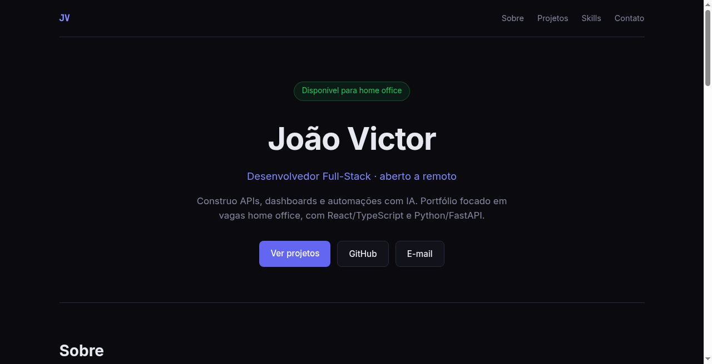

# Site Portfólio — João Victor

Landing em React + TypeScript. TaskFlow aparece em destaque; os cards descrevem stack e status reais (o dashboard do YouTube segue como frontend em evolução).



Versão publicada do currículo:
https://github.com/dev-joaovictor/curriculo  
https://dev-joaovictor.github.io/curriculo/

## Rodar

```bash
npm install
npm run dev
```

Dados em `src/data/projects.ts`. Para build de verificação: `npm run build`.
