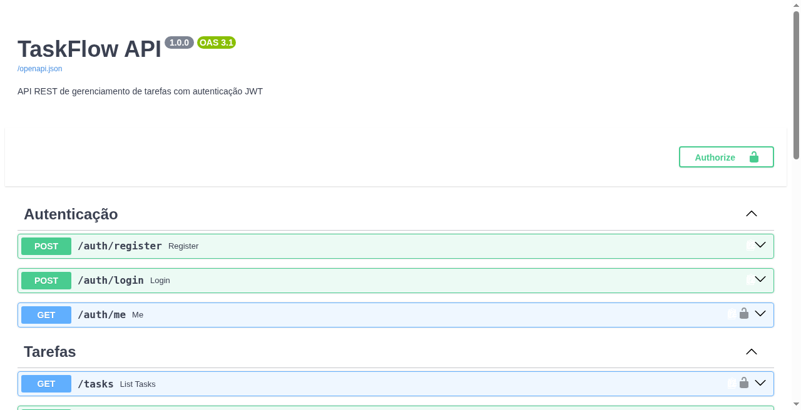

# TaskFlow API

API REST de tarefas com autenticação JWT, CRUD isolado por dono, OpenAPI e Docker.

Projeto backend de referência deste portfólio — o recorte mais completo para demonstrar FastAPI em vagas de estágio/júnior.



## Stack

| Camada | Tecnologia |
|--------|------------|
| API | Python 3.12 · FastAPI · Pydantic v2 |
| Auth | JWT (OAuth2 password) · passlib/bcrypt |
| Dados | SQLAlchemy 2 · SQLite |
| Docs | OpenAPI em `/docs` e `/redoc` |
| Ops | Docker Compose · GitHub Actions · pytest |

## Como rodar localmente

```bash
cd taskflow-api
python -m venv .venv
source .venv/bin/activate  # Windows: .venv\Scripts\activate
pip install -r requirements-dev.txt
cp .env.example .env
uvicorn app.main:app --reload
```

- Health: http://localhost:8000/health
- Swagger: http://localhost:8000/docs
- ReDoc: http://localhost:8000/redoc

O login no Swagger usa o fluxo OAuth2 password: em **Authorize**, o campo `username` é o e-mail cadastrado.

## Docker

```bash
cd taskflow-api
docker compose up --build
```

A API sobe em `http://localhost:8000`. O SQLite fica no volume `taskflow-data` (`/data/taskflow.db` no container), para o código da imagem não ser sobrescrito.

## Exemplos de request

```bash
# cadastro
curl -s -X POST http://localhost:8000/auth/register \
  -H "Content-Type: application/json" \
  -d '{"email":"demo@example.com","password":"secret123","full_name":"Demo User"}'

# login (username = e-mail)
TOKEN=$(curl -s -X POST http://localhost:8000/auth/login \
  -H "Content-Type: application/x-www-form-urlencoded" \
  -d "username=demo@example.com&password=secret123" \
  | python -c "import sys,json; print(json.load(sys.stdin)['access_token'])")

# criar tarefa
curl -s -X POST http://localhost:8000/tasks \
  -H "Authorization: Bearer $TOKEN" \
  -H "Content-Type: application/json" \
  -d '{"title":"Estudar FastAPI","description":"JWT + CRUD","priority":"high"}'

# listar (filtro opcional: ?completed=true|false)
curl -s http://localhost:8000/tasks -H "Authorization: Bearer $TOKEN"

# atualizar
curl -s -X PATCH http://localhost:8000/tasks/1 \
  -H "Authorization: Bearer $TOKEN" \
  -H "Content-Type: application/json" \
  -d '{"completed":true}'
```

Prioridades aceitas: `low`, `medium`, `high`. Tarefas de outro usuário respondem `404` (sem vazar existência).

## Testes

```bash
cd taskflow-api
pip install -r requirements-dev.txt
pytest
```

A suíte cobre health, cadastro/login, CRUD e isolamento por dono. O CI do monorepo (`.github/workflows/taskflow-ci.yml`) roda `pytest` e um smoke em `/health`.

## O que mostra no currículo

- Cadastro/login com JWT e fluxo OAuth2 password
- CRUD isolado por usuário (owner-scoped)
- Validação de entrada e erros HTTP consistentes
- OpenAPI automático
- Testes automatizados + health check
- Container com Compose e persistência em volume
